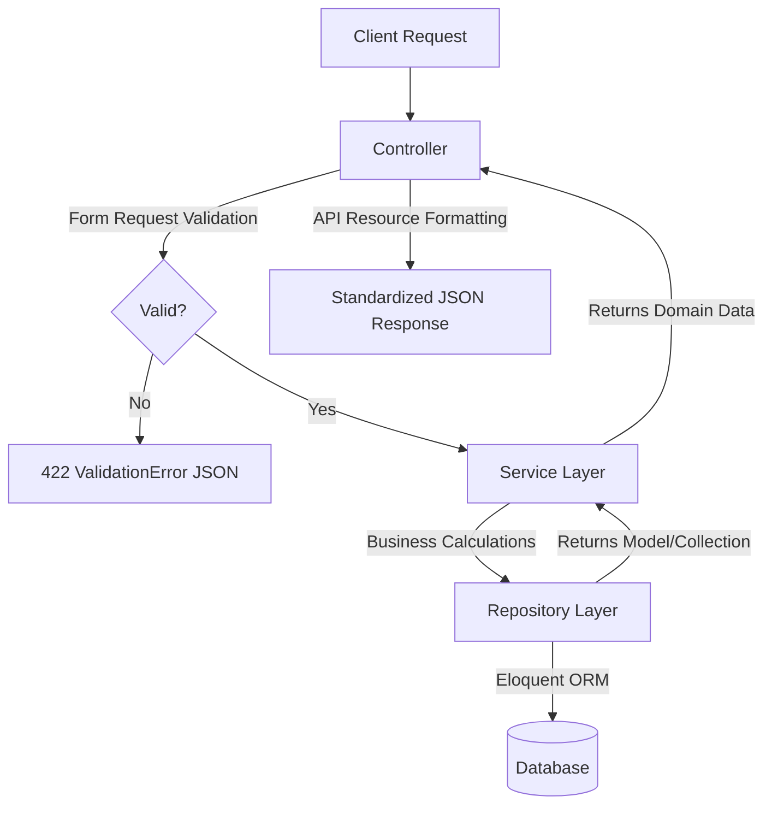
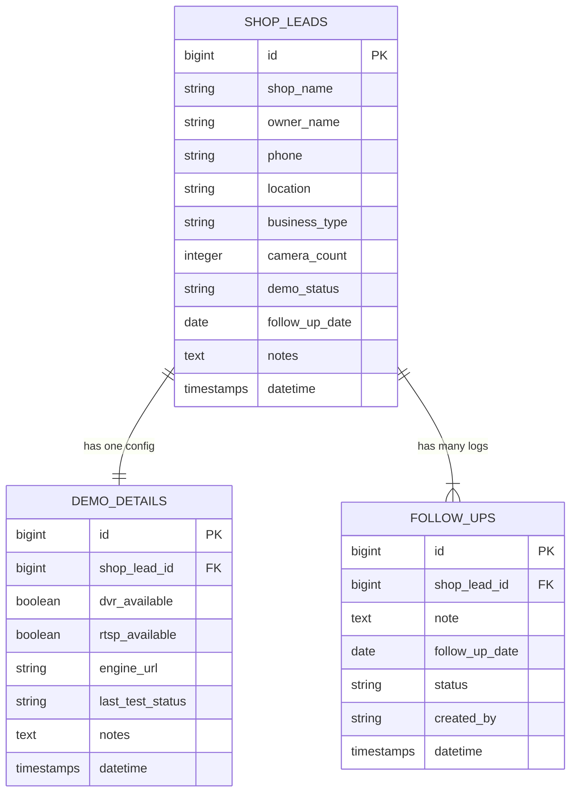

# VisionX Guard Backend API (Laravel 12)

This repository hosts the backend REST API for **VisionX Guard**, a premium Shop Lead and Demo Tracker dashboard. Built using **Laravel 12** and **PHP 8.2+**, it implements Clean Architecture principles with a decoupling of database queries (Repository Pattern) and business logics (Service Layer).

---

## Architecture & Project Structure

The project adopts a decoupled architecture that ensures codebase modularity, testability, and future scalability.

```
app/
 ├── Enums/
 │    └── DemoStatus.php        # Backed string Enum for pipeline status
 ├── Http/
 │    ├── Controllers/Api/      # Controllers handling HTTP payloads & invoking Services
 │    ├── Requests/             # Form Requests validating parameters
 │    └── Resources/            # API Resource converters mapping response JSON shapes
 ├── Models/                    # Eloquent database schemas & relationships
 ├── Providers/
 │    └── AppServiceProvider.php# Registering interface-to-implementation bindings
 ├── Repositories/
 │    ├── Contracts/            # Interface repository declarations
 │    └── Eloquent/             # Concrete database Eloquent queries
 ├── Services/                  # Services encapsulating dashboard and Outreaches logic
 └── Traits/
      └── ApiResponser.php      # Formatter helper ensuring uniform success/error JSONs
```

### Flow of Execution



---

## DB Diagram & Schema Setup

The project manages three principal schemas configured with cascade deletions:



---

## Installation & Setup

Follow these steps to run the backend API server locally.

### Prerequisites
- **PHP 8.2** or higher (with SQLite/PDO extensions active)
- **Composer 2.0** or higher
- **Node.js** & **NPM** (only if compiling local packages)

### 1. Install Dependencies
Navigate to the `backend/` directory and execute:
```bash
composer install
```

### 2. Environment Configuration
Copy the sample environment profile:
```bash
cp .env.example .env
```
Generate the Laravel APP key:
```bash
php artisan key:generate
```

### 3. Database Selection
Laravel 12 configures **SQLite** out-of-the-box, which requires zero local server setup.

#### Option A: SQLite (Default)
Check that `DB_CONNECTION=sqlite` is active in your `.env`. The database will automatically initialize at `database/database.sqlite`.

#### Option B: MySQL
Update your `.env` database block with your local MySQL parameters:
```env
DB_CONNECTION=mysql
DB_HOST=127.0.0.1
DB_PORT=3306
DB_DATABASE=visionx_guard
DB_USERNAME=root
DB_PASSWORD=yourpassword
```

### 4. Run Migrations & Seeders
Execute the migrations to build the tables and populate the database with realistic seed data (**30 shop leads**, **30 demo details**, and **80 follow-up notes**):
```bash
php artisan migrate:fresh --seed
```

### 5. Launch local server
Start the Artisan development server:
```bash
php artisan serve
```
By default, the API will be available at `http://127.0.0.1:8000`.

---

## API Documentation

All request parameters are validated by Form Requests. Responses are wrapped in custom API Resources.

### 1. Dashboard Analytics
* **Endpoint**: `GET /api/dashboard`
* **Response Sample (200 OK)**:
```json
{
  "success": true,
  "message": "Dashboard metrics retrieved successfully.",
  "data": {
    "summary": {
      "total_leads": 30,
      "active_demos": 5,
      "trials_running": 4,
      "converted_shops": 6,
      "trial_expired_leads": 2,
      "pending_followups": 42,
      "conversion_rate": 24.0
    },
    "monthly_growth": [
      { "name": "Jan", "Leads": 2 },
      { "name": "Feb", "Leads": 5 },
      { "name": "Jul", "Leads": 30 }
    ],
    "status_distribution": [
      { "status": "new", "label": "New Lead", "count": 5 },
      { "status": "demo_scheduled", "label": "Demo Scheduled", "count": 5 }
    ],
    "camera_distribution": [
      { "range": "1-10 Cameras", "Shops": 12 },
      { "range": "11-30 Cameras", "Shops": 8 }
    ],
    "upcoming_followups": [
      {
        "id": 12,
        "shop_lead_id": 4,
        "note": "Follow up on hardware setup.",
        "follow_up_date": "2026-07-05",
        "status": "pending",
        "created_by": "Alex Rivera"
      }
    ],
    "overdue_followups": []
  }
}
```

### 2. Shop Leads CRUD
* **List Leads**: `GET /api/shop-leads` (Supports query parameters: `?search=Name`, `?status=new`, `?business_type=retail`, `?sort=camera_count`, `?order=desc`, `?per_page=8`)
* **Create Lead**: `POST /api/shop-leads`
  - *Payload*:
    ```json
    {
      "shop_name": "Apex Electronics",
      "owner_name": "Marcus Vance",
      "phone": "+1 (555) 123-4567",
      "location": "456 Broadway Ave, NYC",
      "business_type": "retail",
      "camera_count": 24,
      "notes": "Highly interested in VIP alerts."
    }
    ```
* **View Lead**: `GET /api/shop-leads/{id}`
* **Update Lead**: `PUT /api/shop-leads/{id}`
* **Delete Lead**: `DELETE /api/shop-leads/{id}`

### 3. Demo Details (Nested)
* **Get Details**: `GET /api/shop-leads/{id}/demo`
* **Save Details**: `PUT /api/shop-leads/{id}/demo`
  - *Payload*:
    ```json
    {
      "dvr_available": true,
      "rtsp_available": true,
      "engine_url": "rtsp://192.168.1.100:554/live",
      "last_test_status": "online",
      "notes": "Configuration successful."
    }
    ```

### 4. Follow-up Tasks (Nested & Standalone)
* **Get Lead Follow-ups**: `GET /api/shop-leads/{id}/followups`
* **Add Follow-up**: `POST /api/shop-leads/{id}/followups`
  - *Payload*:
    ```json
    {
      "note": "Outreach callback regarding SLA contract.",
      "follow_up_date": "2026-07-10",
      "created_by": "Alex Rivera"
    }
    ```
* **Update Follow-up**: `PUT /api/followups/{id}` (e.g. `{"status": "completed"}`)
* **Delete Follow-up**: `DELETE /api/followups/{id}`

---

## Future Improvements & Scalability
- **Authentication**: Integrate Laravel Sanctum token auth for secure user sessions.
- **RBAC**: Setup Laravel Policies to implement Role-Based Access Control (e.g., Shop Lead vs Technician privileges).
- **CCTV Live Stream Engine**: Integrate standard RTSP pipelines to probe camera streams automatically.
- **Redis Caching**: Cache analytics dashboard queries to speed up loading.
- **Unit and Integration Tests**: Scaffold PHPUnit or Pest test arrays to cover the Service layer and route controllers.
